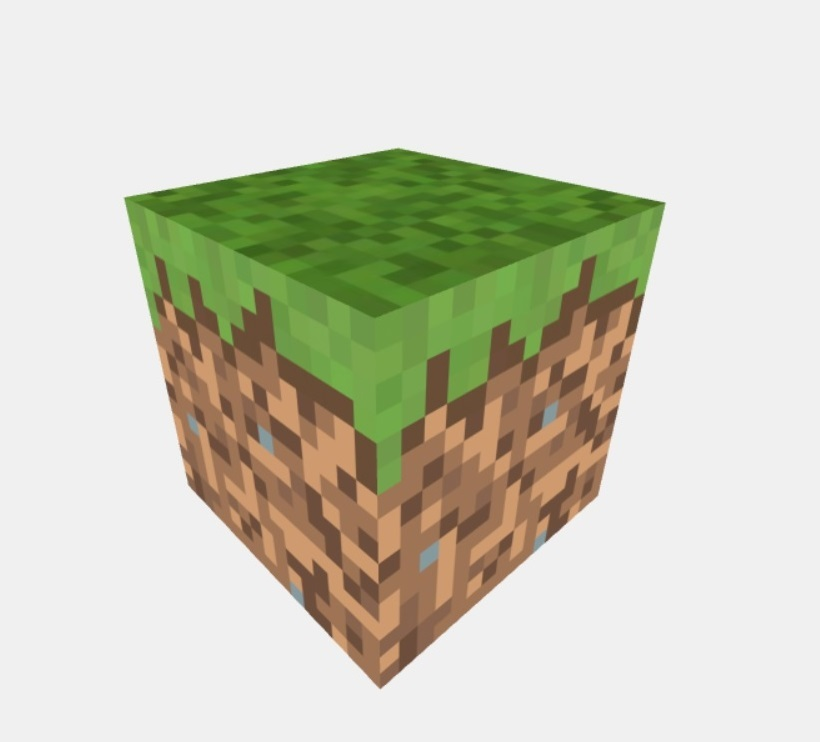

# Relazione per il primo progettino
Autori : Enrico Dal Ben, Haki Dine

## Parte I : Creazione di un terreno basato su heightmap
Autore : Enrico Dal Ben

### Studio e modifica del codice iniziale
Partendo dal codice iniziale fornito dal Professor Ranon nel file StartingCode-nolights.html ho creato un cubo di base con la texture inspirata ai cubi di Minecraft.
Per creare la texture ho caricato 6 texture su un vettore e poi ho generato il materiale con cui ricoprire il cubo.
```javascript
  	var material1 = new THREE.MeshBasicMaterial( { map: new THREE.TextureLoader().load('textures/border.jpg') } );
	var material2 = new THREE.MeshBasicMaterial( { map: new THREE.TextureLoader().load('textures/border.jpg') } );
	var material3 = new THREE.MeshBasicMaterial( { map: new THREE.TextureLoader().load('textures/grass.jpg') } );
	var material4 = new THREE.MeshBasicMaterial( { map: new THREE.TextureLoader().load('textures/dirt.jpg') } );
	var material5 = new THREE.MeshBasicMaterial( { map: new THREE.TextureLoader().load('textures/border.jpg') } );
	var material6 = new THREE.MeshBasicMaterial( { map: new THREE.TextureLoader().load('textures/border.jpg') } );
  
	var materials = [material1, material2, material3, material4, material5, material6];
	var meshGrassMaterial = new THREE.MultiMaterial( materials );
```
Utilizzando il codice presente nel file StartingCode-heightmap.html ho capito come calcolare il colore di un pixel in una heightmap e come ritornare un vettore contenente i dati sulla tonalità di grigio utilizzando la funzione *getHeightData(img)*.



### Sviluppo
Partendo dal cubo iniziale, con texture applicata, ho creato inizialmente un ciclo che mi andava a clonare l'oggetto e poi ha spostarlo nella posizione corretta creando inizialmente un terreno piatto.
Sviluppando ulteriormente questa funzione in una funzione chiamata *CreateTerrain(width, height, data)* ho aggiunto i cubi e combinando il risultato fornito da *getHeightData(img)* sull'immagine, ho modificato la loro coordinata y per adattarla al colore del pixel : più chiaro è il pixel più in alto si troverà il cubo.


Il risultato del metodo *CreateTerrain(width, height, data)* sembra soddisfacente solo ne caso in cui la differenza di altezza da un cubo a un altro si di una unità e quindi non generino spazi vuoti.
Per risolvere questo problema ho modificato il codice di *CreateTerrain* aggiungendo un ciclo che, utilizzando le coordinate di quel punto, generi tutti i cubi fino al piano che ha y=0.
Questi cubi non sono però uguali a quelli generati sopra ma bensi sono dei cubi formati solo dalla texture *dirt.jpg*.
Per realizzare questo progetto ho preso spunto dalle texture di Minecraft poichè offre ottimi spunti per il lavoro con cubi e texture applicabili a essi.


## Parte II : Movimenti di camera e creazione di un video post-procesato
Autore : Hake Dine
